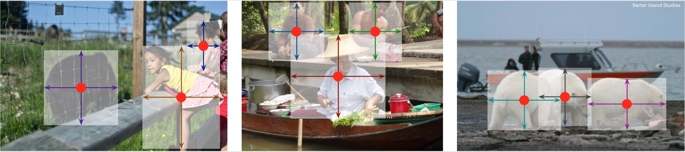
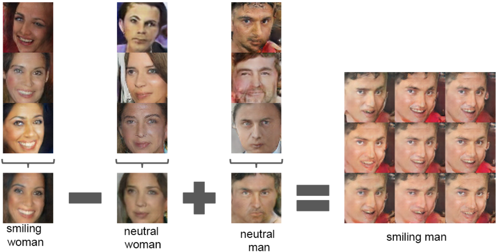

# Resources for AI/ML and LLMs

## LLMs & RAGs

### LLM Agents
* [Introduction to LLM Agents](https://developer.nvidia.com/blog/introduction-to-llm-agents/)

## ML System Design
* [CS 329S: Machine Learning Systems Design](https://stanford-cs329s.github.io/syllabus.html)

## MLOps
* [Machine Learning Engineering for Production (MLOps) Specialization](https://www.coursera.org/specializations/machine-learning-engineering-for-production-mlops)
* [Introducing MLOps](https://www.oreilly.com/library/view/introducing-mlops/9781492083283/)
* [Awesome MLOps](https://github.com/visenger/awesome-mlops)

## Object detection
### Single Stage Detectors
#### SSD: Single Shot MultiBox Detector
* [Paper](https://arxiv.org/abs/1512.02325)
* [Code](https://github.com/aniketmaurya/ssd-tf2-tfds)

### Anchor-less Object Detection Models
<figure>
  
  <figcaption>Source: https://github.com/xingyizhou/CenterNet</figcaption>
</figure>

#### CenterNet: Keypoint Triplets for Object Detection
* [Paper](https://arxiv.org/abs/1904.08189)
* [Code](https://github.com/xingyizhou/CenterNet)

#### CornerNet: Detecting Objects as Paired Keypoints
* [Paper](https://arxiv.org/abs/1808.01244)
* [Code](https://github.com/princeton-vl/CornerNet)
* [Blog](https://opencv.org/latest-trends-of-object-detection-from-cornernet-to-centernet-explained-part-i-cornernet/)

 

## GAN
<figure>
  
  <figcaption>Source: https://github.com/junyanz/CycleGAN/</figcaption>
</figure>

### DCGAN: Unsupervised Representation Learning with Deep Convolutional Generative Adversarial Networks
<figure>
  
  <figcaption>Source: from paper</figcaption>
</figure>

* [Paper](https://arxiv.org/abs/1511.06434)
* [Code](https://github.com/aniketmaurya/GANs-PyTorch-models/blob/main/DCGAN/dcgan.ipynb)
* [Blog](https://hardikbansal.github.io/CycleGANBlog/) - Understanding and Implementing CycleGAN in TensorFlow

### CycleGAN
* [Paper](https://arxiv.org/pdf/1703.10593.pdf)
* [Code](https://github.com/junyanz/CycleGAN)
* [Blog](https://hardikbansal.github.io/CycleGANBlog/) - Understanding and Implementing CycleGAN in TensorFlow

### GradCAM
* [Article](https://fairyonice.github.io/Grad-CAM-with-keras-vis.html)

### Interpretable Machine Learning (A Guide for Making Black Box Models Explainable Book)
* [Online Free version](https://christophm.github.io/interpretable-ml-book/)
* [Ebook](https://leanpub.com/interpretable-machine-learning)
* [Print version](https://www.lulu.com/shop/christoph-molnar/interpretable-machine-learning/paperback/product-24036234.html)

